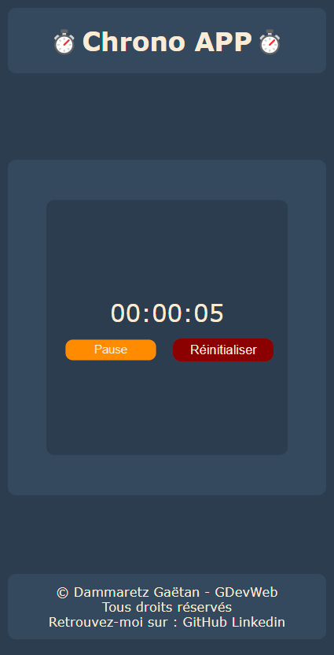

# Application Chronomètre

Bienvenue sur Chrono APP, une application simple pour mesurer le temps avec style. Utilisez ce chronomètre élégant pour suivre le temps écoulé. Profitez également des fonctionnalités de démarrage, d'arrêt et de réinitialisation.

## Table des matières
- [Application Chronomètre](#application-chronomètre)
  - [Table des matières](#table-des-matières)
  - [Aperçu](#aperçu)
  - [Démo](#démo)
  - [Technologies utilisées](#technologies-utilisées)
  - [Comment utiliser](#comment-utiliser)
  - [Installation](#installation)
  - [Crédits](#crédits)
  - [Contact](#contact)
- [Style CSS](#style-css)
- [App.ts](#appts)

## Aperçu


## Démo
[Démo live de l'application](https://simple-chronometer-app.vercel.app/)

## Technologies utilisées
- HTML
- CSS
- TypeScript

## Comment utiliser
1. Ouvrez le fichier `index.html` dans votre navigateur.
2. Utilisez les boutons "Start" et "Réinitialiser" pour contrôler le chronomètre.

## Installation
1. Clonez le repository vers votre machine locale.
   ```bash
   git clone https://github.com/Aescanor/chrono-app.git
   ```
2. Ouvrez le fichier `index.html` dans votre navigateur.

## Crédits
- Conçu et développé par [Dammaretz Gaëtan](https://github.com/Aescanor).

## Contact
- GitHub: [Votre GitHub](https://github.com/Aescanor)
- LinkedIn: [Votre LinkedIn](https://www.linkedin.com/in/ga%C3%ABtan-dammaretz/)

© [Dammaretz Gaëtan] - GDevWeb Tous droits réservés.

---

# Style CSS

```css
:root {
    --mainColor: #2c3d50;
    --secondColor: #34495e;
}

/* ... (le reste du CSS) ... */
```

# App.ts

```typescript
// ... (le reste du TypeScript) ...

// 3. **Chronomètre :**
//    Implémentez un chronomètre simple en TypeScript. Utilisez le DOM pour afficher le temps écoulé et ajoutez des boutons pour démarrer, arrêter et réinitialiser le chronomètre.

// Variables :
//   Boutons :
const startButton: HTMLInputElement | null =
  document.querySelector("#startButton");
const resetButton: HTMLInputElement | null =
  document.querySelector("#resetButton");

//   Affichage :
const display: HTMLElement | null = document.querySelector("#display");

let timer: any;
let isRunning: boolean = false;

let secondes: number = 0;
let minutes: number = 0;
let hours: number = 0;

// Mise en marche / arrêt du script :
function startStop() {
  if (isRunning) {
    clearInterval(timer);

    if (startButton) {
      startButton.innerText = "Start";
      startButton.style.backgroundColor = "darkGreen"
    }
  } else {
    timer = setInterval(updateDisplay, 1000);
    if (startButton) {
      startButton.innerText = "Pause";
      startButton.style.backgroundColor = "darkOrange"
    }
  }

  isRunning = !isRunning;
}

// Mise à jour du temps, conversion H:m:s :
function updateDisplay() {
  secondes++;

  if (secondes === 60) {
    secondes = 0;
    minutes++;
  }

  if (minutes === 60) {
    minutes = 0;
    hours++;
  }

  //   Affichage du temps dans le DOM :
  const displayData: any = `${pad(hours)}:${pad(minutes)}:${pad(secondes)}`;
  if (display) {
    display.innerText = displayData;
  }
}

function reset() {
  clearInterval(timer);
  isRunning = false;
  secondes = 0;
  minutes = 0;
  hours = 0;

  if (display) {
    display.innerText = "00:00:00";
  }

  if (startButton) {
    startButton.innerText = "Start";
  }
}

function pad(value: number) {
  return value < 10 ? `0${value}` : value;
}

// Events :
startButton?.addEventListener("click", startStop);
resetButton?.addEventListener("click", reset);


//Date dynamique du footer :
const currentYearElement : HTMLElement | null = document.getElementById("currentYear");

const currentYear: number = new Date().getFullYear();

if(currentYearElement){
    currentYearElement.textContent = currentYear.toString();
}
```